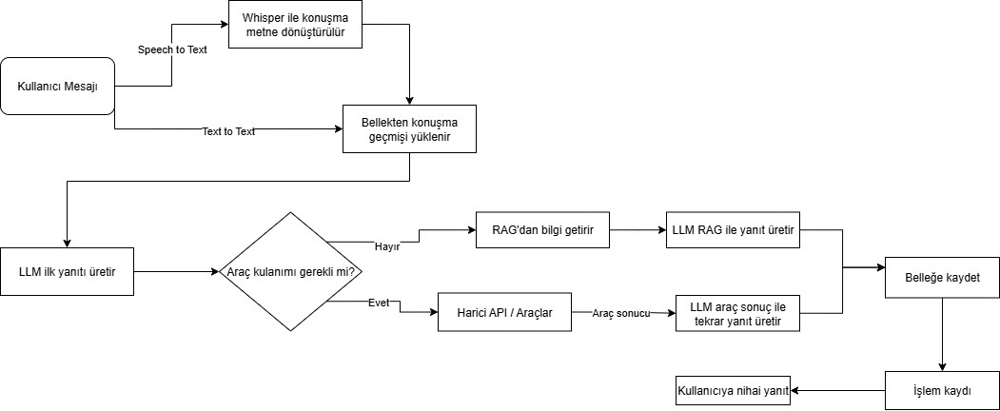

# CallCenterAgent

## Sistem Mimarisi



Sistem mimarisi yukarıdaki gibidir. Mimari aşağıdaki şekilde çalışmaktadır:

- Kullanıcıdan sesli veya yazılı bir mesaj alınır.
- Sesli mesajlar whisper modelini kullanarak yazıya çevrilir.
- Önceden gelen bir mesajlaşma varsa, modelin hatırlayabilmesi için eski mesajlaşma yüklenir.
- Model gelen mesaja nasıl yanıt vereceğini düşünmeye başlar ve bir araç kullanıp kullanmayacağına göre bir yol seçer.
- Eğer harici apiden veri gerekiyorsa gerekli araç veya araçları kullanıp gerekli veriyi alıp kullanıcının anlayacağı yönde bir yanıt üretir.
- Model bir araç ile veri alması gerekmiyor ise Rag sistemini kullanarak benzer diyaloglara ulaşır ve bu diyaloglardan yola çıkarak yine kullanıcının anlayacağı yönde bir mesaj üretir.
- Ürettiği mesaj sonraki kullanımlar için belleğe kaydedilir.

## Kullanılan LLM'ler ve Framework

- Bu projede Agentic yaklaşım için Langchain frameworkunu kullandık.
- Agent için ve veri setini Türkçeye çevirmek için Gemma3 12b modeli
- Kullandığımız veri setinin linki: https://huggingface.co/datasets/talkmap/telecom-conversation-corpus
- Vektör veri tabanını oluşturmak için intfloat/multilingual-e5-large modeli kullanıldı.

## İmplemente Edilen Senaryolar ve Mock Fonksiyonlar


- `post_new_user`: Kullanıcıların sisteme yeni kayıt oluşturmasını sağlar.
- `control_location_have_problem`: Kullanıcının bulunduğu bölgede teknik bir arıza olup olmadığını sorgular.
- `get_user_remainining_uses`: Kullanıcının mevcut paketinde kalan dakika, SMS ve internet haklarını listeler.
- `get_service_purchase`: Kullanıcının satın aldığı ek hizmet ve paketleri gösterir.
- `get_active_invoice_items`: Kullanıcının aktif faturasındaki kalemleri ve detayları listeler.
- `get_active_invoice_by_usernumber`: Kullanıcının aktif fatura bilgilerini getirir.


## Kurulum

1. **Depoyu Klonlayın**
   ```powershell
   git clone https://github.com/cevrimici/CallCenterAgent.git
   cd CallCenterAgent
   ```

2. **Python Sanal Ortamı Oluşturun**
   ```powershell
   python -m venv venvv
   .\venvv\Scripts\Activate.ps1
   ```

3. **Gerekli Paketleri Yükleyin**
   ```powershell
   pip install -r requirements.txt
   ```

4. **Ek Dosyaları Kontrol Edin**
   - `e5.index`, `translated_dialogs.csv`, `conversation_ids.csv` dosyalarının ana dizinde olduğundan emin olun.
   - API sunucusunun (ör. FastAPI) arka planda çalıştığından emin olun (`localhost:8000`).


## Çalıştırma

```powershell
python main.py
```


## Notlar

- API endpointleri ve dosya yolları sabitlenmiştir, ihtiyaca göre düzenleyebilirsiniz.
- RAG (Retrieval Augmented Generation) fonksiyonu için ek dosyalar gereklidir.
- Model ve API anahtarı ayarlarını `main.py` dosyasından değiştirebilirsiniz.


## Karşılaştığımız Zorluklar ve Çözümleri

- Veri setimiz çok temiz bir veri seti değildi, veri setini belli etiketler belirleyerek ön işleme adımını gerçekleştirdik.
- Veri setini Türkçeye çevirirken denediğimiz modeller güzel çeviriler yapmadı, en uygun model için birçok model denedik.
- Ajanımız kullanacağı araçları ne zaman kullanacağında kararsızlıklar yaşıyor ve halisünasyonlar görüyordu. Bunun için uygun prompt mimarilerini kullandık.
- Veri setini vektör veri tabanına çevirirken belirlediğimiz model bize iyi bir çıktı vermedi, başka modeller denemek zorunda kaldık.

## Eklenen Ek Özellikler ve Senaryolar

- Whisper kullanarak kullanıcıların sadece metin girerek değil ses ile de ajanla konuşabilmesini sağladık.
- Rag sistemi kurarak ajanımızın her zaman düzgün yanıtlar verebilmesini sağladık.
- Rag sisteminde kullandığımız veri setiyle birçok farklı senaryoya cevaplar verebilir.

Bu proje, bir telekomünikasyon şirketi için müşteri temsilcisi (agent) otomasyonunu sağlar. Müşterilerden gelen talepleri çeşitli API araçları ile yanıtlar ve geçmiş konuşmalardan faydalanarak daha iyi hizmet sunar.

## Ölmümleme Sonuçları

Yapılan test senaryolarını LLMJudge yöntemiyle değerlendirilmesi sonucunda:

llm_agent_test_scenarios_benchmark dosyası test verisini içermektedir.

Intent Accuracy (Niyet Doğruluğu): %77,66
Sistemin kullanıcı niyetini doğru anlama oranı, genel testlerde dörtte üçten fazla başarı sağlamıştır.

Tool Efficiency (Araç Kullanım Verimliliği): %88,49
Hedeflenen işlem adımlarının, gereksiz adım eklenmeden veya eksik yapılmadan gerçekleştirilme oranı oldukça yüksektir.

Türkçe Uyum (Turkish Compliance): %100
Üretilen tüm cevaplar dil bilgisi, anlam bütünlüğü ve Türkçe kullanımı açısından tam uyum sağlamıştır.

Bu sonuçlar, sistemin kullanıcı niyetlerini doğru algılama ve araçları verimli kullanma konusunda güçlü bir performansa sahip olduğunu, ayrıca Türkçe dilinde tam uyum sağladığını göstermektedir.

## Ölçekleme İhtiyaçları
Bu projenin ölçeklenebilirliğini artırmak için aşağıdaki başlıklar dikkate alınmalıdır:

1. **Model Sunucularının Ayrıştırılması ve Dağıtık Çalıştırılması:**
Whisper, Gemma3 ve vektör tabanlı modeller ayrı sunucularda veya bulut tabanlı olarak çalıştırılabilir. Model sunucularını konteynerleştirmek (Docker) ve gerektiğinde otomatik ölçeklendirmek (Kubernetes, autoscaling) önerilir.

2. **Veri Tabanı ve Vektör Index Yönetimi:**
Vektör index ve kullanıcı geçmişi gibi veriler, yüksek hacimli sorgularda performans kaybı yaşatabilir. Vektör veritabanı için ölçeklenebilir bir çözüm (ör. Milvus, Pinecone, Weaviate) tercih edilmeli, veri tabanı replikasyonu ve sharding uygulanmalıdır.

3. **Dosya ve Veri Yönetimi:**
CSV ve index dosyaları yerine, ölçeklenebilir veri tabanları ve bulut depolama çözümleri kullanılmalıdır. Dosya tabanlı sistemler, eşzamanlı erişim ve veri bütünlüğü açısından sınırlıdır.

4. **Trafik ve Yük Dengeleme:**
Kullanıcı sayısı arttıkça API sunucuları ve model sunucuları için yük dengeleyici (load balancer) kullanmak gereklidir. Böylece istekler sunucular arasında dengeli şekilde dağıtılır.

5. **Kayıt, İzleme ve Hata Yönetimi:**
Sistem bileşenleri için merkezi loglama, izleme (monitoring) ve hata yönetimi (ör. Prometheus, Grafana, ELK stack) kurulmalıdır. Bu sayede performans ve hata takibi kolaylaşır.

Bu başlıklar, projenin hem teknik hem operasyonel olarak daha büyük ölçeklerde sorunsuz çalışmasını sağlar.